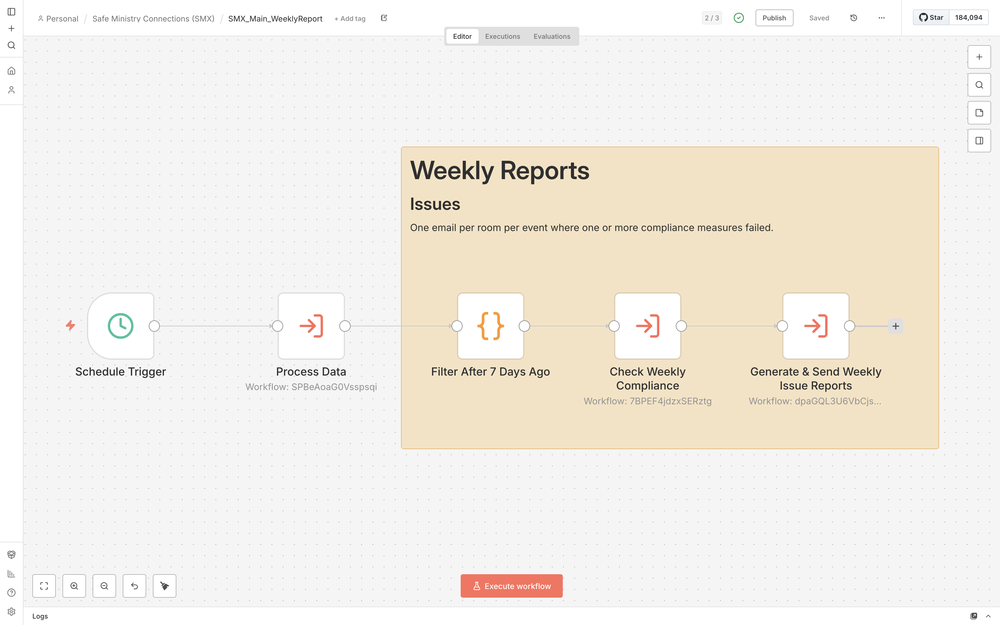
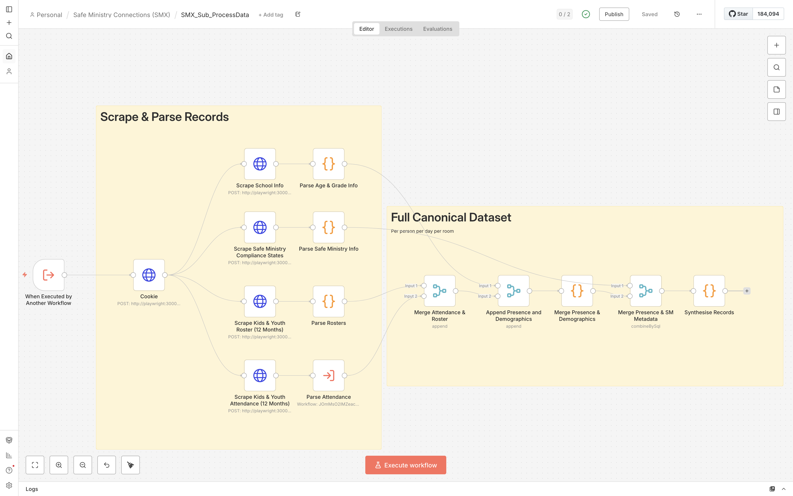

# Safe Ministry Connections (SMX)

**Automating Safe Ministry compliance for Sydney Anglican churches — live safety checks, automated reporting, and zero admin burden for ministry teams.**

## About
SMX is a custom n8n automation system that connects Elvanto, Adminosaur, and ClickSend to deliver real-time Safe Ministry compliance monitoring and reporting for churches. It runs 24/7 on a self-hosted Hostinger VPS.

## Value Add
- **Eliminates administrative burden** on volunteer ministry teams by fully automating Safe Ministry compliance checks, reporting, and notifications — freeing them to focus on pastoral care rather than paperwork.
- **Delivers real-time safety monitoring** with automated compliance scans every 5 minutes during services and instant SMS alerts to leaders when issues arise.
- **Automates professional governance reporting** — generates accurate weekly, monthly, and historical compliance reports with zero manual effort.
- **Enhances emergency preparedness** with instant SMS roll-call tools (“roll” and “evac”) and UPS-backed service continuity.

## Key Features
- Live 5-minute check-in monitoring with automated leader alerts
- Scheduled weekly/monthly compliance and issue reports
- Emergency SMS roll-call system
- Smart room resolution from Elvanto/Adminosaur groups
- Multi-channel notifications (SMS + email)

## Tech Stack
- **Automation**: n8n (main + sub-workflows)
- **Scraping**: Playwright (headless browser)
- **Hosting**: Hostinger VPS (Ubuntu 24.04)
- **Containerisation**: Docker + Docker Compose + Traefik
- **Integrations**: ClickSend SMS, Hostinger SMTP

## Project Status
This repository contains **documentation and screenshots only**. Full workflow exports and Docker setup are not public for security and IP reasons.

Interested in deploying SMX in your church? Contact me — I can provide the complete package and adaptation support.

## Screenshots

## Documentation
Full user and maintainer guides are included (room mapping, adding/removing rooms, n8n structure, VPS/Docker maintenance, troubleshooting).

## Contact
**Paul** — [@sevasek](https://x.com/sevasek)

---
Built to help churches serve safely and efficiently.