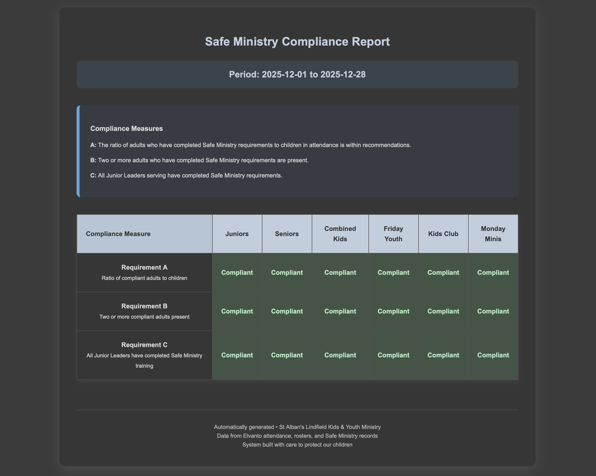
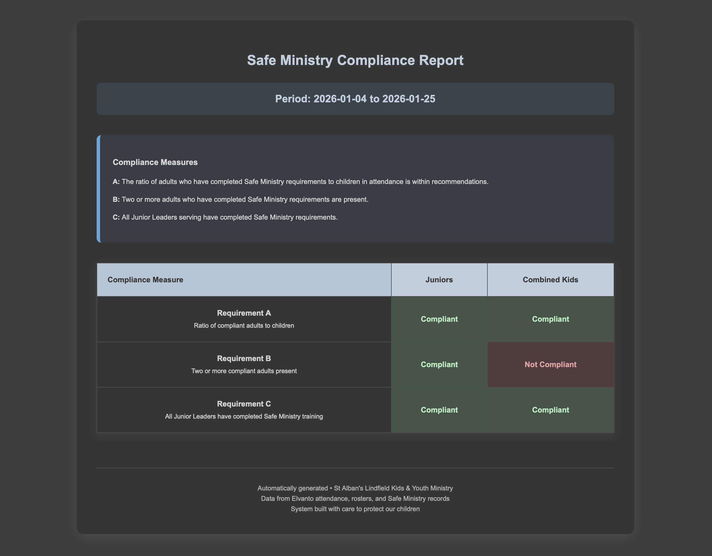
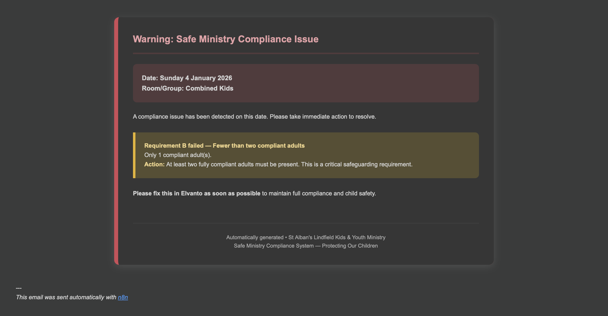
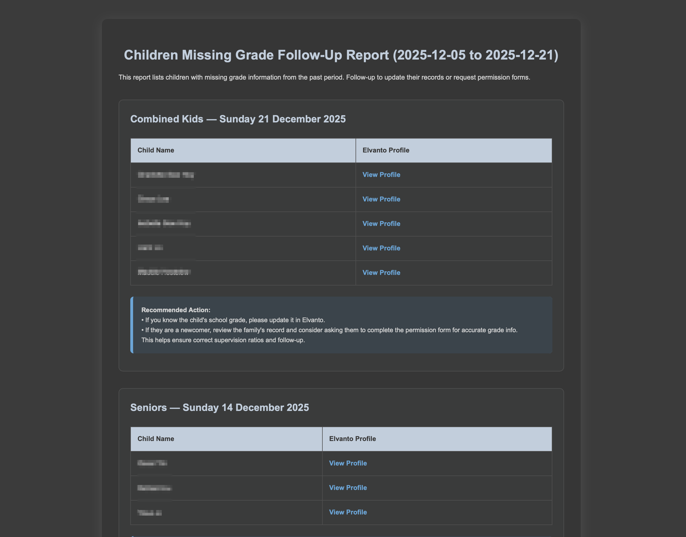

# Safe Ministry Connections (SMX)

**Automating Safe Ministry compliance for Sydney Anglican churches — live safety checks, automated reporting, and zero admin burden for ministry teams.**

## About

Safe Ministry Connections (SMX) is a custom-built automation system that helps churches maintain **Safe Ministry best practices** as defined by the Sydney Anglican Diocese. It connects Elvanto, Adminosaur, and other ministry systems to deliver:

- Live compliance monitoring during services
- Automated weekly, monthly, and historical Safe Ministry reports
- Instant check-in/roll-call via SMS during emergencies
- Notifications to leaders when compliance issues arise

The goal is simple: **remove the administrative burden** of Safe Ministry compliance from volunteer ministry teams so they can focus on discipling young people.

Built for **St Albans Anglican Lindfield** (and adaptable for other churches), SMX runs 24/7 on a lightweight VPS using n8n workflows.

## Key Features

- **Live Check-in Monitor** — Scans Adminosaur every 5 minutes on Sunday mornings and alerts leaders of any compliance issues (e.g., insufficient (or no) leaders)
- **Automated Reporting**
  - Issue Report on historical attendance records to department leaders
  - Overview Reports on all compliance measures to governance leaders
- **Emergency SMS Tools**
  - Send “roll” → get current children checked into your room
  - Send “evac” → get full roll call across all rooms
- **Smart Room Resolution** — Automatically maps Elvanto and Adminosaur groups to ministry rooms (i.e., domains of supervision)
- **Multi-channel Notifications** — Email for detailed information processes, SMS for simple notifications
- **Full audit trail** via n8n execution history

## Tech Stack

- **Automation Core**: n8n (self-hosted)
- **Scraping**: Playwright (headless browser automation for Elvanto & Adminosaur)
- **Hosting**: Hostinger VPS (Ubuntu 24.04)
- **Containerization**: Docker + Docker Compose (with Traefik reverse proxy)
- **SMS**: ClickSend
- **Email**: Hostinger SMTP

## Project Status

This repository contains **documentation only** (the full n8n workflow export and Docker setup are **not** included here for security and IP reasons).

**Interested in deploying SMX in your church?**  
Contact me directly — I can provide the complete workflow export, setup instructions, and support for adaptation to your systems.

## Documentation

Full user and maintainer documentation is available.

Key sections include:
- How SMX determines “Rooms” from group names
- Adding, renaming, or removing ministry rooms
- Adding children and leaders
- n8n workflow structure (Main + Sub workflows)
- VPS/Docker maintenance
- Troubleshooting common issues

## Screenshots / Demo

**Monthly Compliance Report - Compliant**

**Monthly Compliance Report - Not Compliant**

**Weekly Compliance Issue Report**

**Weekly Missing Grade Follow-up Report**

<em>Automated email reports showing compliant vs non-compliant states and follow-up actions.</em>

## For Church Admins / End Users

1. Ensure attendance and check-in data is entered accurately in Elvanto and Adminosaur.
2. Ministry leaders can text `roll` or `evac` to the designated number for instant roll calls.
3. Compliance alerts are automatically sent to relevant departmental and governance leadership.

No daily login required — the system runs automatically.

## For Developers / Maintainers

The system is designed to be maintainable by someone familiar with n8n and Docker.

**Main Workflows:**
- `SMX_Main_Switchboard` — SMS webhook handler
- `SMX_Main_CheckinMonitor` — Live Sunday morning monitoring
- `SMX_Main_MonthlyReportA` / `SMX_Main_MonthlyReportB`
- `SMX_Main_WeeklyReport`

**Sub-workflows** handle data processing, compliance checks, and notifications.

**Important Notes:**
- Credentials are stored in `/docker/n8n/.env` and n8n credential manager
- Playwright container handles secure scraping of both Elvanto and Adminosaur
- Room mapping logic lives in Code nodes (easily extensible)

Full maintenance guide is included in the documentation.

## Roadmap (Potential Enhancements)

- Historical compliance trend reporting

## License

Proprietary — All rights reserved.  
This project was developed for St Albans Anglican Lindfield and is not open-source.  
The workflows contain sensitive credentials and church-specific logic.

For licensing, adaptation, or deployment in another church, please contact the author.

## Contact

**Paul**
- X: [@sevasek](https://x.com/sevasek)
- Email: (available upon serious inquiry)

---

Built with care to help churches serve safely and efficiently.