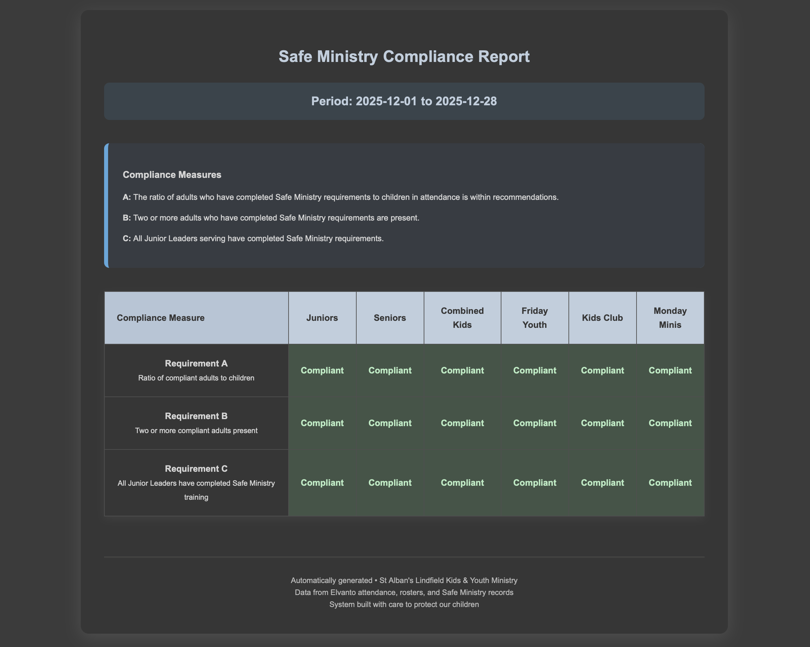
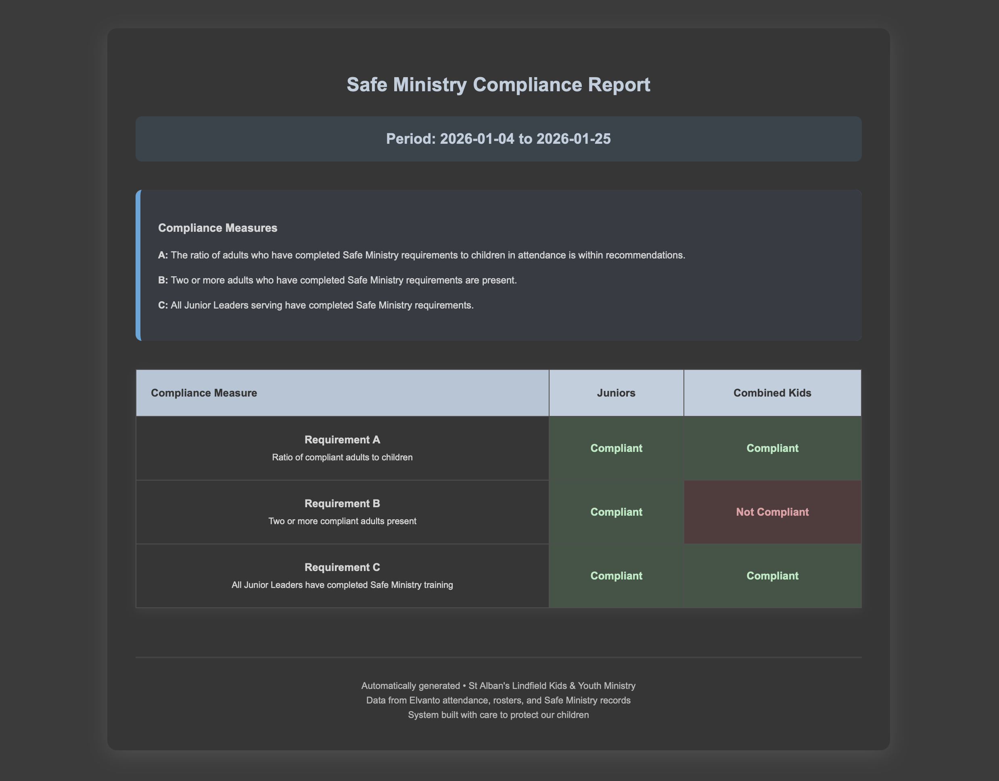
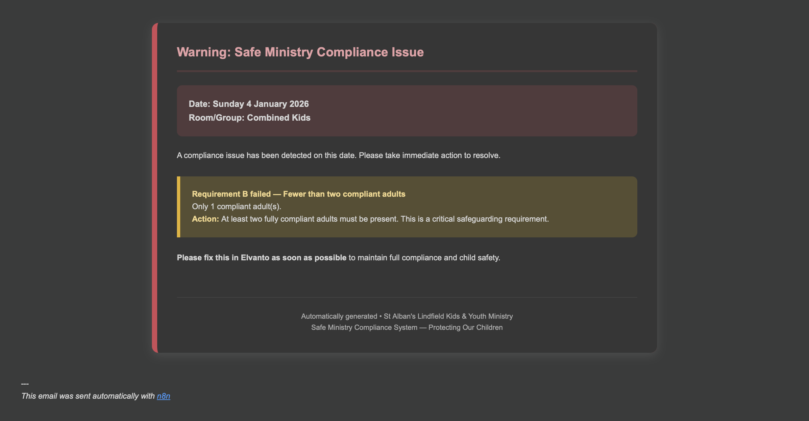
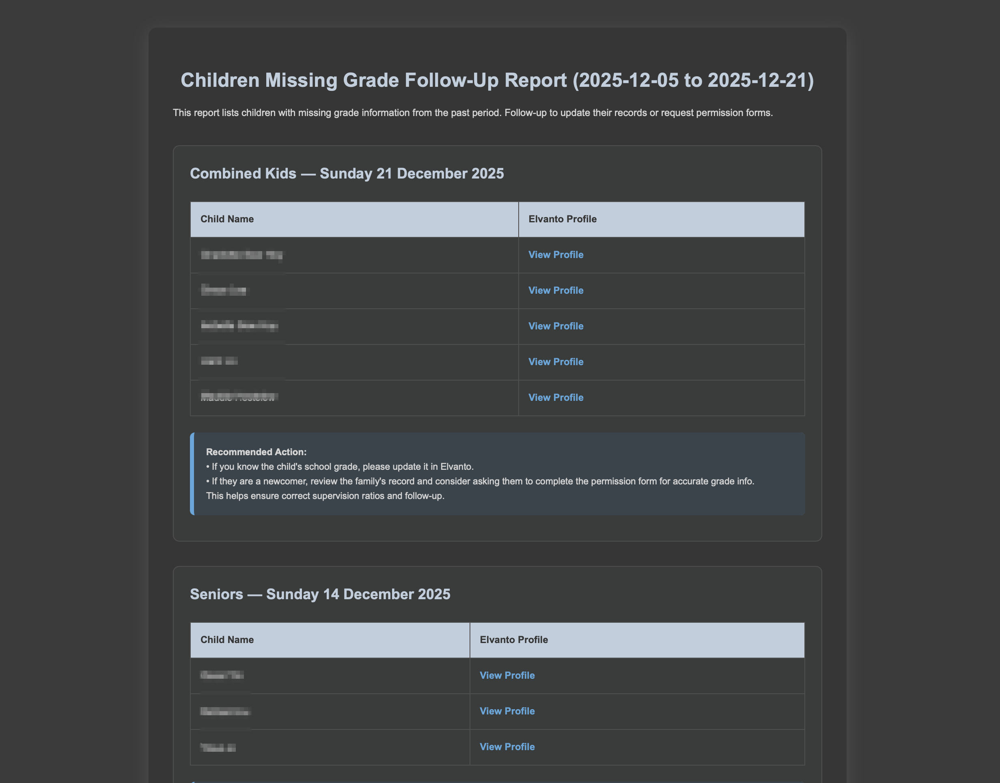
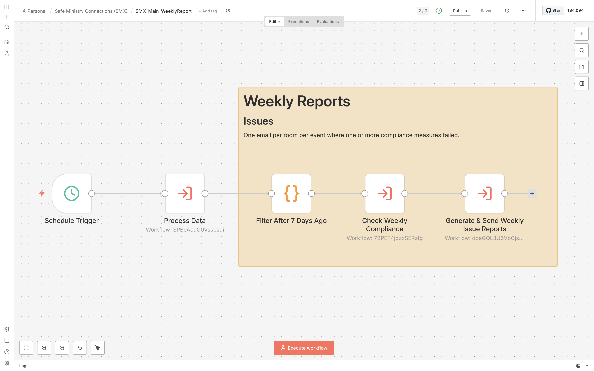
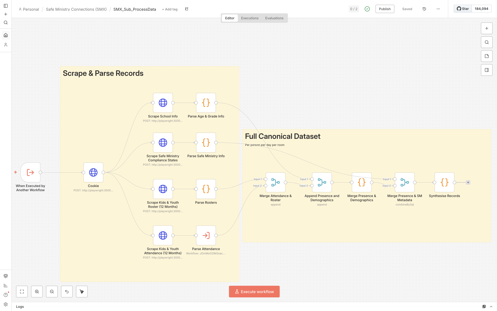

# Safe Ministry Connections (SMX)

**Automating Safe Ministry compliance for Sydney Anglican churches — live safety checks, automated reporting, and zero admin burden for ministry teams.**

## About
SMX is a custom n8n automation system that connects Elvanto, Adminosaur, and ClickSend to deliver real-time Safe Ministry compliance monitoring and reporting for churches. It runs 24/7 on a self-hosted VPS.

## Value Add
- **Eliminates administrative burden** on volunteer ministry teams by fully automating Safe Ministry compliance checks, reporting, and notifications — freeing them to focus on pastoral care rather than paperwork.
- **Delivers real-time safety monitoring** with automated compliance scans every 5 minutes during services and instant SMS alerts to leaders when issues arise.
- **Automates professional governance reporting** — generates accurate weekly, monthly, and historical compliance reports with zero manual effort.
- **Enhances emergency preparedness** with instant SMS roll-call tools ("roll" and "evac") and UPS-backed service continuity.

## How It Works

SMX runs five main n8n workflows in orchestration:

| Workflow | Purpose | Trigger |
|---|---|---|
| `CheckinMonitor` | Polls Adminosaur every 5 minutes during services; sends SMS alerts when compliance issues are detected | Schedule |
| `WeeklyReport` | Aggregates check-in data and emails a weekly compliance issues report | Schedule |
| `MonthlyReportA` | Monthly all-clear or issues overview, plus missing Safe Ministry grade follow-up list | Schedule |
| `MonthlyReportB` | Bi-monthly compliance overview for extended tracking windows | Schedule |
| `Switchboard` | Handles inbound SMS commands — `roll` sends a room roll-call, `evac` broadcasts a full evacuation roll | Webhook |
| `ExpiryForecast` | Weekly scan for volunteers with certs expiring within 30/60/90 days; emails tiered admin report and SMS-reminds 30-day cases | Schedule |

Each main workflow delegates to sub-workflows for data processing, report generation, and notification dispatch — keeping logic modular and independently testable.

## Key Features
- Live 5-minute check-in monitoring with automated SMS alerts to leaders
- Scheduled weekly and monthly compliance and issue reports
- Emergency SMS roll-call system via inbound `roll` / `evac` keywords
- Smart room resolution from Elvanto and Adminosaur group mappings
- Multi-channel notifications (SMS + email)

## Tech Stack
- **Automation**: n8n (main + sub-workflows)
- **Check-in data**: Adminosaur REST API (direct sync via `SMX_Sub_ProcessAdminosaur_API`)
- **Integrations**: Elvanto ChMS, ClickSend SMS, SMTP
- **Hosting**: VPS (Ubuntu 24.04)
- **Containerisation**: Docker + Docker Compose + Traefik

## What's in This Repo

| Path | Contents |
|---|---|
| `main-workflows/` | Seven exported n8n workflow JSON files — five main workflows, `SMX_Sub_ProcessAdminosaur_API` sub-workflow, and the new `SMX_Main_ExpiryForecast` expiry-alert workflow |
| `docs/screenshots/` | Example compliance reports and workflow screenshots |

> Sub-workflows, Docker Compose config, and environment variables are not included for security and IP reasons. Interested in deploying SMX at your church? Contact me — I can provide the complete package and adaptation support.

## Screenshots

## Documentation
Full user and maintainer guides are included with the complete package (room mapping, adding/removing rooms, n8n structure, VPS/Docker maintenance, troubleshooting).

## 🚀 Roadmap & Future Releases

**Shipped:**
- ✅ **Adminosaur-native check-in sync** — replaced Playwright scraping with a direct Adminosaur REST API integration (`SMX_Sub_ProcessAdminosaur_API`), eliminating the headless browser and reducing check-in latency to under a minute.
- ✅ **Expiry forecasting & proactive alerts** — `SMX_Main_ExpiryForecast` runs weekly to identify volunteers whose Safe Ministry certifications expire within 30/60/90 days, emails a tiered admin report, and sends individual SMS reminders (via ClickSend) to anyone in the 30-day window.

| Priority | Feature | Why It Matters | Implementation Sketch | Effort |
|---|---|---|---|---|
| Medium | **Multi-church support** | Several dioceses run near-identical Safe Ministry processes; a single-tenant-per-instance design caps SMX's reach to one parish. Multi-tenancy is the difference between a personal tool and something offered to other churches. | Parameterise the workflows by church/org ID, move per-church config (room mappings, contact lists) into a lookup table or lightweight DB, and add a per-church dashboard view to the reporting workflows. | High |

**Deprioritised for now:** AI-generated natural-language compliance summaries — interesting, but low leverage until the above coverage gap is closed.

## Contact
**Paul** — [@sevasek](https://x.com/sevasek)

---
Built to help churches serve safely and efficiently.
